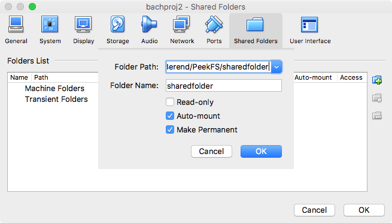
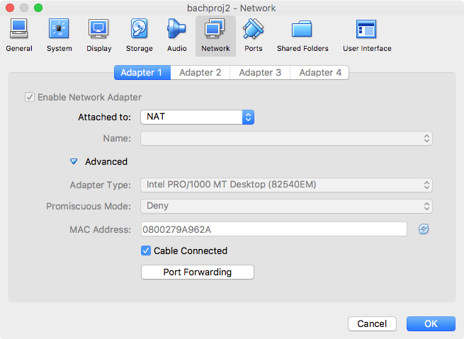
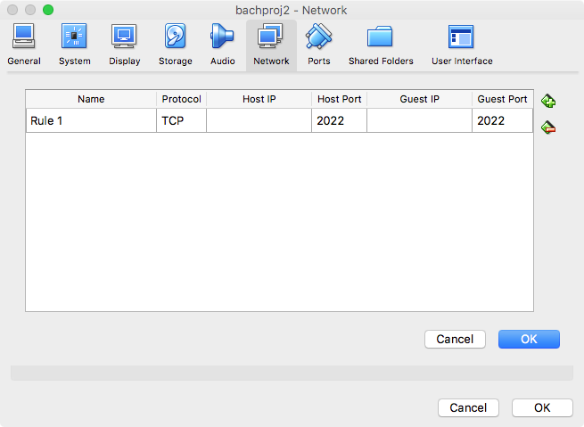

# peekviz
UI for peekFS state visualization and components for educational use.

### FROM A FRESH UBUNTU 15.10 INSTALL

  * Set up a shared folder that mounts in Ubuntu VM at /media/sf_sharedfolder (for VirtualBox this happens automatically with with settings pictured below (directory on host must be called "sharedfolder"))

    * 
  * Forward port 2022 from host to guest in Ubuntu VM (see pics below)
    * 
    * 
  * Add yourself to vboxsf group on Ubuntu VM:
    * ```sh
      sudo adduser $USER vboxsf
      ```

```sh
BITBUCKET_USERNAME=pistoletpierre # CHANGE TO YOUR BITBUCKET USERNAME
ROOT_DIR=$HOME/llvmapps-minix

sudo apt-get install bison curl flex g++ gcc gettext git make pkg-config python ssh subversion zlib1g-dev

cd $HOME
git clone https://$BITBUCKET_USERNAME@bitbucket.org/vusec/llvmapps-minix
cd llvmapps-minix
./autosetup-minix.sh
```
#### This will take a while. After it finishes...

#### If desired, now is the time to add your custom drivers to MINIX. Modify the following files and directories to include your driver(s).
```sh
ROOT_DIR="$HOME/llvmapps-minix"

MI_FILE=$ROOT_DIR/apps/minix/minix/distrib/sets/lists/minix/mi
MINIX_MODS_MAP=$ROOT_DIR/apps/minix/minix/minix.mods.map
SYSTEM_CONF_PATH=$ROOT_DIR/apps/minix/obj.i386/destdir.i386/etc/system.conf
MINIX_ROOT_DIR=$ROOT_DIR/apps/minix/obj.i386/destdir.i386/root
DRIVERS_PATH=$ROOT_DIR/apps/minix/minix/minix/drivers/examples
MAKEFILE_PATH=$ROOT_DIR/apps/minix/minix/minix/drivers/examples/Makefile
```

#### Rebuild MINIX.

```sh
cd $HOME/llvmapps-minix
./autosetup-minix.sh
```

#### Then, install clang (don't do this before - the MINIX build failed for us if clang was already installed) for 'magic' installation

```sh
sudo apt-get install clang # IF YOU EVER NEED TO ./autosetup-minix.sh AGAIN, MAKE SURE TO UNINSTALL CLANG (not tested yet but hypothesized by process of elimination)
cd $ROOT_DIR/llvm/static/magic
make install
cd $ROOT_DIR/llvm/passes/magic
make install
```

### Build MINIX image with custom drivers instrumented

```sh
CUSTOM_DRIVERS="driver1,driver2,etc"
/media/sharedfolder/driverframework/relink-build.sh $CUSTOM_DRIVERS
```

<!--
#### Then...
 * In llvmapps-minix/apps/minix/minix/minix/llvm/clientctl, change MEMSIZE from 512 to 2048
-->

### Launch MINIX VM and set up networking

```sh
cd $HOME/llvmapps-minix/apps/minix
RUNARGS=" -net user -net nic " ./clientctl run
```
#### IN MINIX...
```sh
netconf # select default values
shutdown -pD now
```


#### After it's shut down, start it back up again and install pkgin, the package manager and GNU tree 1.7
```sh
cd $HOME/llvmapps-minix/apps/minix
RUNARGS=" -net user -net nic " ./clientctl run

## IN MINIX
passwd # set root password
ftp http://www.minix3.org/pkgsrc/packages/3.3.0/i386/All/pkg_install-20130902nb1.tgz
tar -zxf pkg_install-20130902nb1.tgz -C/
pkg_add http://www.minix3.org/pkgsrc/packages/3.3.0/i386/All/pkgin-0.6.4nb5.tgz

yes | pkgin update
yes | pkgin install openssh curl

# 'install' tree 1.7
mkdir tree
cd tree
curl ftp://ftp.netbsd.org/pub/pkgsrc/packages/NetBSD/i386/6.1_2016Q2/All/tree-1.7.0.tgz -o tree.tgz
tar -xvzf tree.tgz
mv bin/tree /sbin/tree17

# shut down
shutdown -pD now
```

#### Now you're ready to rock and roll. Launch the VM.

```sh
cd $HOME/llvmapps-minix/apps/minix
RUNARGS=" -localtime -net user,hostfwd=tcp::2222-:22 -net nic " ./clientctl run
```
#### Connect to it with the server at sharedfolder/current-version/server_autoreboot.py <listening port>
